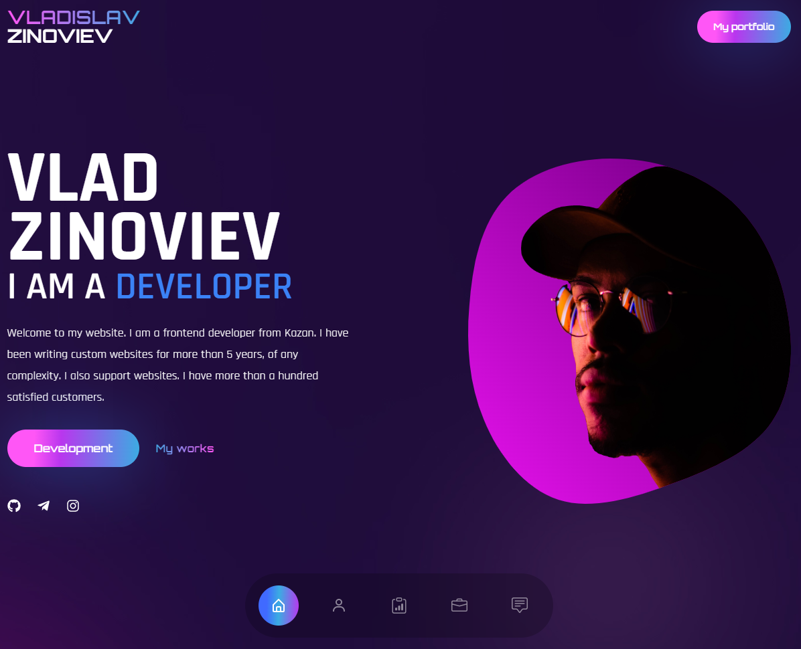
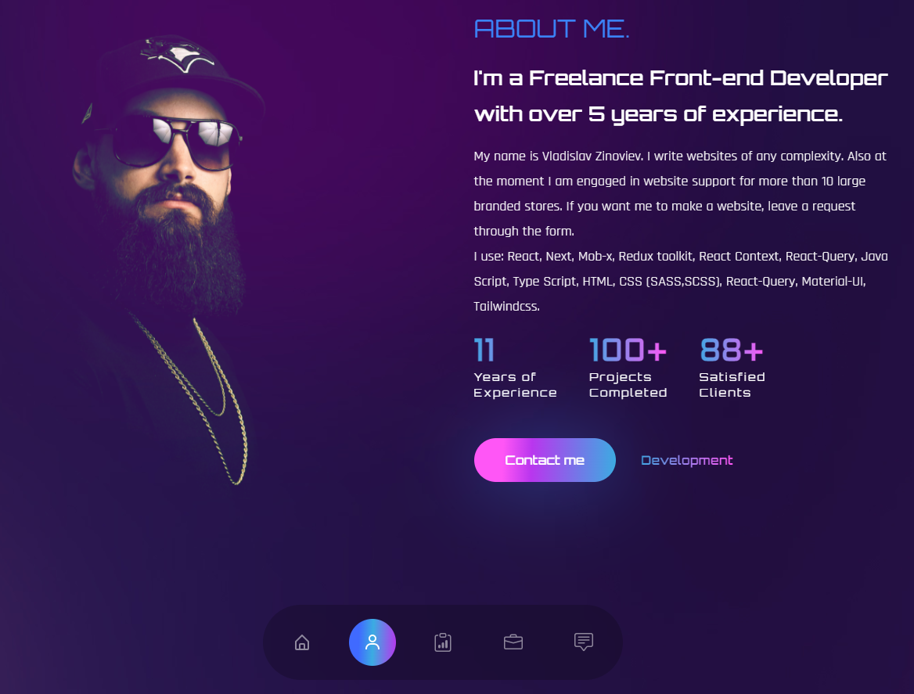
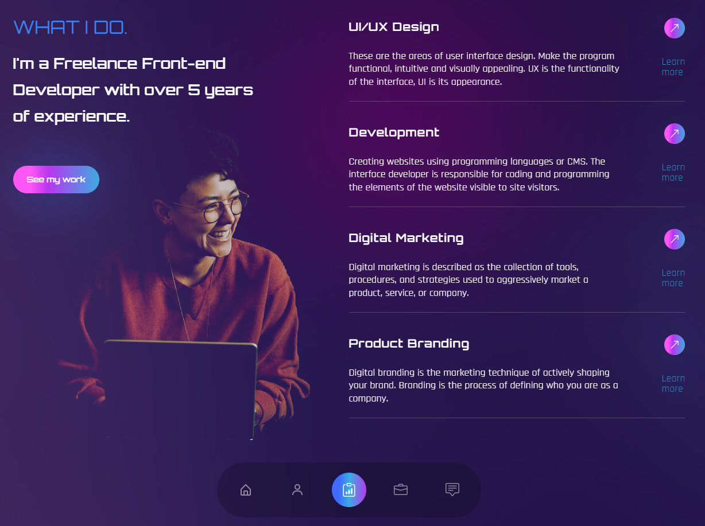
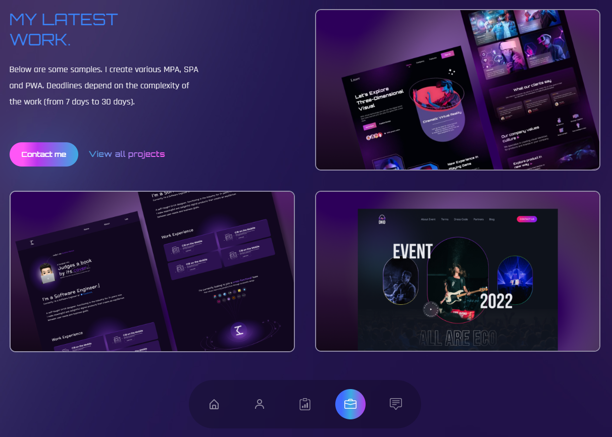
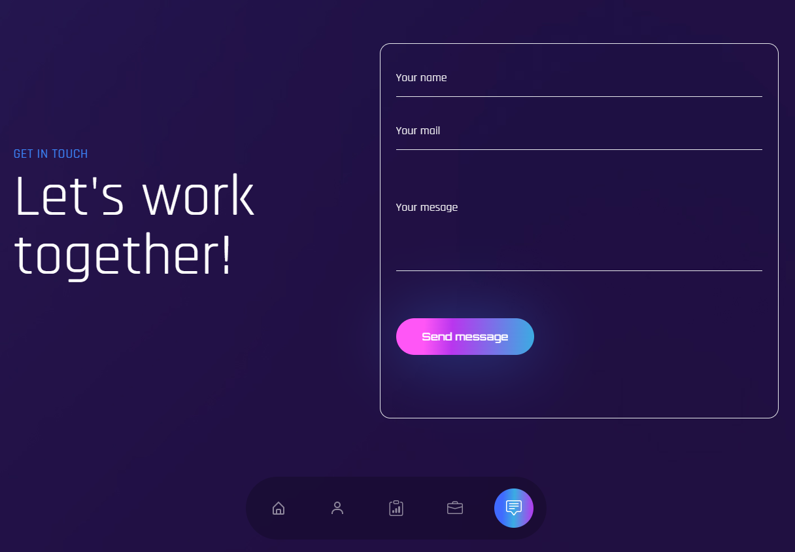

# Portfolio

**Demo project:** [portfolio](https://vladzinovev.github.io/portfolio/).

## Header сайта



В данной секции мы можем перейти по кнопке 'My portfolio' в блок 'About me', где описана информация обо мне.
Ниже две кнопки: 'Development' и 'My works', которые соответственно ведут в блоки: 'What i do'-описание разработки и 'My latest works'-примеры работ. 
Чуть ниже иконки с ссылками на сторонние сайты (GitHub, Telegram, Instagram). 
В самом низу отображена навигация по сайту.

## About me или My portfolio



Тут написана информация обо мне. 
Ниже расположены две кнопки 'Contact me'-секция для заполнения формы обратной связи и 'Development' в блок 'What i do',где описание разработки.

## What i do или Development



Данная секция показывает, что я умею. Расписаны все основные компоненты, описание которых можно прочитать перейдя по ссылке 'Learn more' или кнопки со стрелкой. Перейдя по кнопке 'See my work' вы попадёте в секцию 'My latest work'.

## My latest work



Секция 'My latest work' показывает список крутых работ и краткое описание. 
Ниже расположены две кнопки 'Contact me'-секция для заполнения формы обратной связи и 'View all projects' - ссылка на GitHub.

## Форма обратной связи



Заполните все поля и нажмите на кнопку 'Send message', далее сообщение придет мне на почту и я увижу ваши контакты и текст сообщения.

## Стек технологий

```
React
TypeScript
Tailwindcss
```